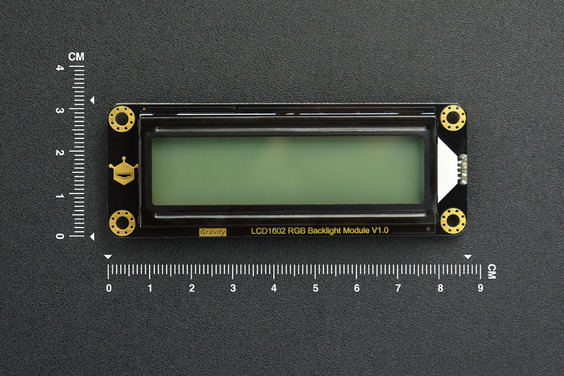

# DFRobot_RGBLCD1602

- [中文版](./README_CN.md)

Have you been fed up with Black/White LCD screen? Do you want to try a colorful one? DFRobot I2C 16x2 Arduino LCD with RGB Backlight Display module will bring you a new experience about screen. It comes with RGB full color backlight, which has 16 million kinds of color. This I2C 16x2 LCD Screen is using an Gravity I2C communication interface. It means it only needs 2 communication lines for the communication and backlight control. The LCD can display 2x16 characters and support scrolling-displaying and cursor movement. Without tedious wiring and complicated codes, you can just utilize the specific Arduino library to accomplish all the design.





## Product Link(https://www.dfrobot.com/product-1609.html)

    SKU：DFR0464

## Table of Contents

* [Summary](#summary)
* [Installation](#installation)
* [Methods](#methods)
* [Compatibility](#compatibility)
* [History](#history)
* [Credits](#credits)

## Summary

DFRobot Gravity I2C LCD1602 with RGB Backlight Display can display 2x16 characters and support functions like scrolling-displaying, cursor movement and backlight color adjustment

## Installation

To use this library, please download the library file first, paste it into the custom directory of Raspberry Pi, then open the examples folder and run the demo in this folder
This library needs to use wiringpi, so before using the library, check whether Raspberry Pi has imported wiringpi, if not, import it first
python2: pip install wiringpi
python3: pip3 install wiringpi

## Methods

```python
  '''
    @brief write character
    @param data the written data
  '''
  def write(self,data):

  '''
    @brief set RGB
    @param r  red   range(0-255)
    @param g  green range(0-255)
    @param b  blue  range(0-255)
  '''
  def set_RGB(self,r,g,b):

  '''
    @brief set cursor position
    @param col columns optional range 0-15
    @param row rows optional range 0-1，0 is the first row, 1 is the second row
  '''
  def set_cursor(self,col,row):

  '''
    @brief clear the display and return the cursor to the initial position (position 0)
  '''
  def clear(self):

  '''
    @brief scroll left to display
  '''
  def scroll_display_left(self):

  '''
    @brief scroll right to display
  '''
  def scroll_display_right(self):

  '''
    @brief output data to LCD to display
    @param arg output data
  '''
  def print_out(self,arg):

  '''
    @brief return the cursor to the initial position（0,0）
  '''
  def home(self):

    '''
      @brief Turn off the display
    '''
  def no_display(self):

  '''
    @brief Turn on the display
  '''
  def display(self):

  '''
    @brief Turn  off the blinking showCursor
  '''
  def stop_blink(self):

  '''
    @brief Turn on  the blinking showCursor
  '''
  def blink(self):

  '''
    @brief Turn off the underline showCursor 
  '''
  def no_cursor(self):

  '''
    @brief Turn on the underline showCursor 
  '''
  def cursor(self):

  '''
    @brief This is for text that flows Left to Right
  '''
  def left_to_right(self):

  '''
    @brief This is for text that flows Right to Left
  '''
  def right_to_left(self):

  '''
    @brief This will 'left justify' text from the showCursor
  '''
  def no_autoscroll(self):

  '''
    @brief This will 'right justify' text from the showCursor
  '''
  def autoscroll(self):

  '''
    @brief Allows us to fill the first 8 C
    @param location substitute character range（0-7）
    @param charmap  character listing the size is 8 bytes
  '''
  def customSymbol(self,location, charmap):

  '''
    @brief blink the LED backlight
  '''
  def blink_LED(self):

  '''
    @brief the LED backlight doesn't blink
  '''
  def no_blink_LED(self):

  '''
    @brief set the backlight
    @param mode  true indicates the backlight is turned on and set to white, false indicates the backlight is turned off
  '''
  def setBacklight(self,mode):

  '''
     @brief set backlight PWM output
     @param color  backlight color  Preferences：REG_RED\REG_GREEN\REG_BLUE
     @param pwm  color intensity   range(0-255)
  '''
  def set_pwm(self,color,pwm):

  '''
     @brief set the backlight to white
  '''
  def set_color_white(self):

  '''
    @brief close the backlight
  '''
  def close_backlight(self):
```

## Compatibility

* RaspberryPi Version

| Board        | Work Well | Work Wrong | Untested | Remarks |
| ------------ | :-------: | :--------: | :------: | ------- |
| RaspberryPi2 |           |            |    √     |         |
| RaspberryPi3 |     √     |            |          |         |
| RaspberryPi4 |           |            |    √     |         |

* Python Version

| Python  | Work Well | Work Wrong | Untested | Remarks |
| ------- | :-------: | :--------: | :------: | ------- |
| Python2 |     √     |            |          |         |
| Python3 |     √     |            |          |         |


## History

- Date 2021-9-26
- Version V1.0.0


## Credits

Written by yangfeng(feng.yang@dfrobot.com), 2021. (Welcome to our [website](https://www.dfrobot.com/))
